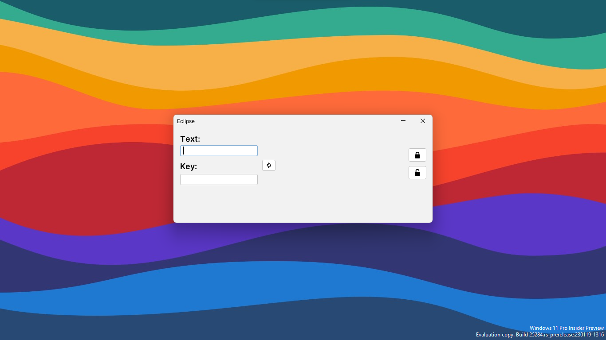

# Eclipse

> a tiny [Vigenère cipher](https://en.wikipedia.org/wiki/Vigen%C3%A8re_cipher) app implemented with Java and [Swing](https://en.wikipedia.org/wiki/Swing_(Java))

another term, another hastily done project to appease the teacher-people and the people who pay the teacher-people.

also side-note, Swing was replaced by JavaFX in 2007, so it's not exactly modern.
why teacher people, why??

not really much here, I didn't put a lot of effort into it like [Echelon](https://github.com/poopsicles/EchelonForms) because...exams.
Also Java is just annoying to work with sometimes...what kind of language has no `Array.min()` method 😭.

check out that scrambling animation thoooooo

project submission [here](writeup.pdf).

## pics

|  |
|:--:|
| *The application when first opened* |

|  |
|:--:|
| *Encrypting a string* |

|  |
|:--:|
| *The animation* |

|  |
|:--:|
| *Decrypting a string* |

## this so cool (❤️ ω ❤️)...how can i run it

- Clone the repository.

```sh
$ git clone https://github.com/poopsicles/Eclipse.git
  
...some output
```

- Download [JetBrains IntelliJ](https://www.jetbrains.com/idea/download/).

- Open the folder with IntelliJ and push the green play button.

## Todo

- [ ] make it look actually okay
